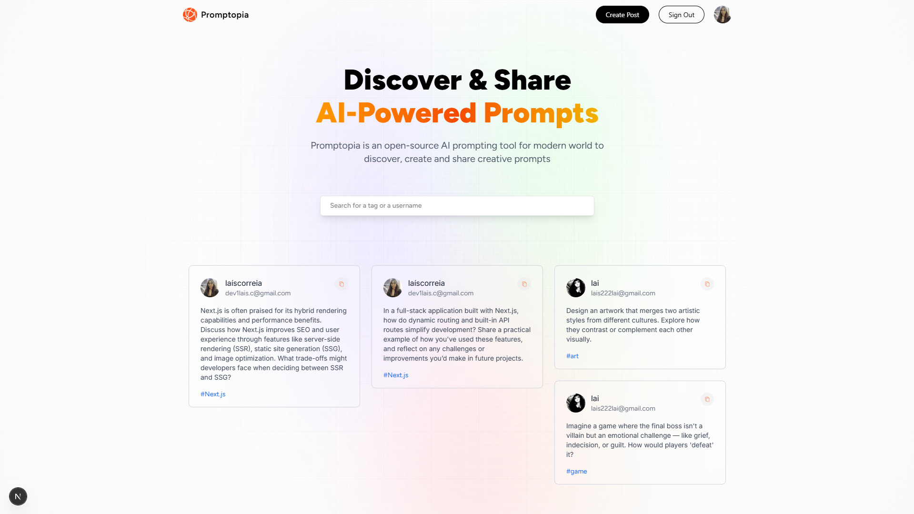

# 🌍 Promptopia

Promptopia is an open-source full-stack web application that allows users to **discover, create, and share AI-powered prompts** with the world. Built with modern web technologies, it offers a sleek and intuitive interface for prompt enthusiasts to connect and collaborate.

## 🚀 Live Demo

👉 [Visit Promptopia Live](https://promptopia-chri-bmqin21gh-lais-projects-3a989d2f.vercel.app/)

## 🛠️ Tech Stack

- **Next.js** – Framework for server-side rendering and routing
- **React** – UI library for building interactive components
- **MongoDB & Mongoose** – Database and ODM for storing prompts and user data
- **NextAuth.js** – Authentication and session management
- **Tailwind CSS** – Utility-first styling
- **JavaScript** – Core language powering the app

## ✨ Features

This project was originally created by [JavaScript Mastery](https://github.com/adrianhajdin) as a learning resource. I followed the tutorial and built the core structure, but also implemented several features entirely on my own:

- 🔍 **Advanced Search** – Search prompts by username, tag, or content
- 👤 **User Profiles** – Visit and explore other users' public profiles
- 🔐 **Login Gate** – Custom login screen that appears if the user is not authenticated

## 📚 What I Learned

Promptopia was my **first experience with Next.js**, and it taught me a ton about:

- Building and consuming **REST APIs**
- Creating **dynamic routes** and pages
- Managing **authentication flows** with NextAuth
- Connecting and querying a **MongoDB database**
- Structuring a full-stack project for scalability

